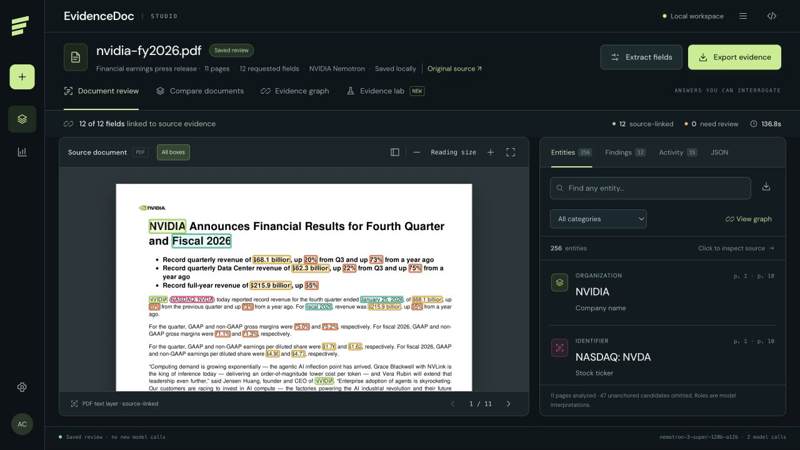

# EvidenceDoc — Evidence Studio

Document intelligence with inspectable source evidence. NVIDIA Nemotron discovers entities and fields; source coordinates, graph connections and explicit abstention make results reviewable.

## Watch the demo

[Detailed demo · 3:03](https://github.com/ahmetcankaraoglan/evidencedoc/releases/latest) · [Social cut · 2:01](https://github.com/ahmetcankaraoglan/evidencedoc/releases/latest)

English narration and captions. The videos show actual UI interactions and NVIDIA model results on original public documents. See the [demo source kit and reproducible outcomes](docs/demo/README.md).

## Current application

- English interface with a graphite review workspace and saturated, category-specific bounding boxes.
- Comfortable reading size by default; whole-page overview is one click away. Select an entity to focus its source.
- Source preview appears after ingestion, before model completion. The scan animation runs on the actual page.
- Searchable entities, source context and an interactive document/page/entity citation graph.
- Graph lenses for repeated values across pages and the same value assigned different roles; same-page neighbors are inspection cues, not verified relationships.
- Evidence Lab removes selected source text and masks corresponding pixels in a separate copy, then runs fresh extraction without supplying the previous answer.
- All bundled inputs are original public-source PDFs with source URLs and SHA-256 hashes.



Source shown: [NVIDIA Q4 and FY2026 earnings report (original English PDF)](https://nvidianews.nvidia.com/_gallery/download_pdf/699f6ab43d6332ccaa689907/).

## Start

Python 3.11+ is required. Install Tesseract for scanned documents; digital PDFs use their original text layer.

```sh
git clone https://github.com/ahmetcankaraoglan/evidencedoc.git
cd evidencedoc
make install
make run
```

Open http://127.0.0.1:8765 and connect a key in Model & settings. The browser key form stores it in server memory until restart. NVIDIA calls send source text and any retry crops to the configured endpoint. API keys are not included in this source release.

New document contains public examples from NVIDIA, the Federal Reserve and TCMB. Public examples use NVIDIA mode. You may also upload your own PDF, PNG or JPEG. Limits: 20 MB and 12 pages.

The bundled public files and their original URLs/SHA-256 hashes are listed in [the source manifest](evidencedoc/public_documents/manifest.json). The source link appears in the document header when its hash matches the manifest.

## Evidence Lab

Choose NVIDIA earnings report to test the dividend payment date, or Central bank decision to test the TCMB decision date. Inspect the preselected source regions and run Withhold & re-evaluate. The displayed outcome is generated by a real extraction, not a scripted animation. The original document remains unchanged; experimental masks are derived from the real source.

In a September 10 live run, removing the NVIDIA report's April 1, 2026 dividend-date evidence caused a fresh NVIDIA extraction to abstain (one new call, approximately 2.5 seconds). This is a case observation, not a guarantee. Another unmasked source could support the same answer.

## Models and limitations

Current text model: `nvidia/nemotron-3-super-120b-a12b`. Targeted visual retries: `nvidia/nemotron-3-nano-omni-30b-a3b-reasoning`. PDF text/OCR geometry is currently produced locally. Nemotron OCR/Parse, embedding and reranking models are not integrated in this release.

Entity values must have literal source anchors. Roles and categories are model interpretations. Discovery can miss entities and is capped at 90 candidates per page. A citation does not establish truth or correctness of the inferred role. OCR cases may retain line-level boxes. Graph edges represent source citations, not inferred real-world relationships. Evidence Lab tests source dependence, not truth.

## Validation

```sh
make test
```

Ten regression checks use original public PDFs and their extracted data: source checksums, source links, precise date boxes, masking without changing the original, preview-before-result behavior, route validation and same-origin checks. 

The earlier real-document development evaluation used six public PDFs, 36 pages and 49 requested fields. It is a small reused development set, not an independent benchmark. See [the real-document report](docs/real-evaluation.html). Public-source results and failed attempts are retained in `evaluation/`.

## Release and attribution

Application code is AGPL-3.0-or-later; see [LICENSE](LICENSE). NVIDIA models, services, fonts and dependencies retain their own license terms. Public-source documents belong to their respective publishers and are included as source examples with attribution; the application license does not relicense their content. AI coding assistance was used.

The application is intended for a local desktop workspace. Public hosting requires authentication and data isolation. Demo videos are available in Releases. No contest entry is submitted automatically.
